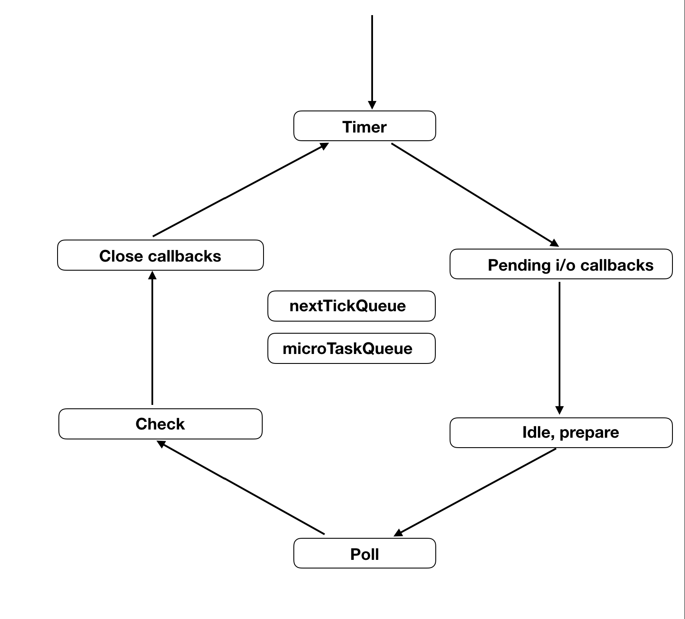

Here we have a picture about phases of event loop

Each boxes in the image above indicates a phase which is dedicated to perform some specific work. Each phase (except Idle, prepare) have a "queue" attachd to it and JS execution can be done in any of those phases.

1. Timer phase  
    The starting phase in event loop. This queue holds the timer callbacks (setTimeout, setInterval). The data structure in this phase is like a min heap, it maintains the timer in that min heap and executes whose timer is elapsed.  
    So event loop enters the timer phase and checks if anything is there in the timer queue to be executed. Well, the statement may sound very simple, but event-loop actually has to perform few steps to find the appropriate callbacks.
Actually the timer scripts are stored in a heap memory in ascending order. So it will first take the timer and calculate if now - registeredTime == delta. If yes, it will execute the callback of that timer and will check for the next timer. Whenever a timer is not found whose time is not elapsed, it will stop checking others (as timers are sorted in ascending order) and move to the next phase.

2. Pending I/O callbacks  
   This phases executes callsback which are there in the pending_queue of event loop. These kinds of callbacks are pushed in the previous operations. For an example when we write something in TCP handler and the work is done, then the callback will be pushed in this queue. Error callbacks can also be found here
3. Idle, Prepare phase 
   This phase are for internal operations of node
4. Poll phase  
   Maybe the most important phase of entire event loop, this phase accepts  new imcoming connections (new socket establishment) and data (file read). Can divide the work of poll in few different parts 
- If there is something in the **watch_queue** (attached to poll phase), they will be executed synchronously one after another, till the time the queue is empty or the system specific     max limit is reached.
- One the queue is empty, node will try to wait for new connections. If there is any task pending in **check_queue**, **pending_queue**, it will wait for zero ms. However it will then execute the first timer (if available) from **timer_heap** to decide the waiting time. If the first timer threshold is elapsed, then obviously it won't wait at all.
5. Check phase  
   This phase is dedicated for setImmediate() call backs.
6. Clock callbacks  
   Close type of callbacks (socket.on('close', () => {})) are handled here. More like a cleanup phase.
7. nextTickQueue & microTaskQueue (promises)
   Tasks in these two are not really part of event loop. They are called ASAP, whenever the boundary between C/C++ and JS is crossed. So they are supposed to be called right after currently running operation (not necessarily the current executing JS function callback)

## Few common questions
1. Where does the javascript get executed?
As many of us had an understanding of event-loop being spinning in a separate thread and pushing callbacks in a queue and from that queue one by one callbacks are executed; people when first read this post may get confused where exactly the JavaScript gets executed.
Well, as I said earlier as well, there is only one single thread and the javascript executions are also done from the event loop itself using the v8 (or other) engine. The execution is completely synchronous and event-loops will not propagate if the current JavaScript execution is not completed.

2. Why do we need setImmediate, we have setTimeout(fn, 0)?
First of all this is not zero. It is 1. Whenever you set a timer with any value lesser than 1 or grater than 2147483647ms, it is automatically set to 1. So whenever you try to set SetTimeout with zero, it become 1.

3. setImmediate reduces the headache of extra checking as we already discussed. So setImmediate will make things faster. It is also placed right after poll phase, so any setImmediate callback invoked from a new incoming request will be executed soon.

4. Why setImmediate is called immediate?
Well, both setImmediate and process.nextTick has been named wrongly. Actually setImmediate phase is touched only once in a tick or iteration and nextTick is called as soon as possible. So functionally setImmediate is nextTick and nextTick is immediate. :P

5. Can JavaScript be blocked?
As we already have seen, nextTickQueue doesn’t have any limit of callback execution. So if you recursively call process.nextTick(), your program will never come out of it, irrespective of what all you have in other phases.

6. What if I call setTimeout in exit callback phase?
It may initiate the timer but the callback will never be called. Cause if node is in exit callbacks, then it has already came out of the event loop. Thus no question of going back and execute.
